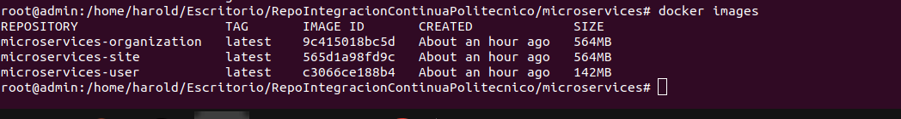
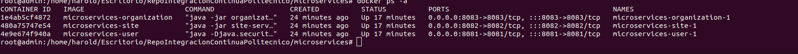

# Integración continua, implementación docker compose - microservice Java

Creación de múltiples microservicios con Spring Boot e implementación y ejecución con docker compose.

## Tabla de contenido

* [Arquitectura](#Arquitectura)
* [Tecnologias](#Tecnologias)
* [Pre-requisitos](#Prerequisitos)

## Arquitectura

El proyecto esta construido en microservicios. Tenemos tres microservicios independientes (Usuario,
Sitio y Organización), que se conectan a la base de datos H2 y se comunican entre sí mediante RestTemplate. Usamos
Docker Compose para implementarlos y ejecutarlos en contenedores docker.

## Tecnologias

1. Java 8
2. Maven Dependency Management
3. Spring Boot in microservices development:

    + Spring Web
    + Spring Data JPA
    + Spring Devtools
    + Spring Actuator

4. H2 database
5. Docker

### Prerequisitos

Se necesitan las siguientes herramientas:

* Java JDK 1.8+
* Maven 3.0+
* Git client
* Docker Compose: To [install docker-compose](https://docs.docker.com/compose/install/)

### Desarrollo

Pasos a seguir:

**Paso 1.** Construcción de *microservicios* usando Spring Boot y comunicación entre ellos por RestTemplate:

+ [User microservice](user-service)
+ [Site microservice](site-service)
+ [Organization microservice](organization-service)

**Paso 2.** Crear el *Dockerfile* para cada servicio. El archivo Docker es una lista de comandos que queremos que el
motor de la ventana acoplable
ejecutar.

Vaya al directorio de cada proyecto Spring Boot y cree un Dockerfile:

+ User microservice [Dockerfile](user-service/Dockerfile)
+ Site microservice [Dockerfile](site-service/Dockerfile)
+ Organization microservice [Dockerfile](organization-service/Dockerfile)

Ejemplos Dockerfile

```bash
From openjdk:8
copy ./target/users-service-0.0.1-SNAPSHOT.jar user-service.jar
CMD ["java","-jar","user-service.jar"]
```

**Paso 3.** Crear [docker-compose.yml](docker-compose.yml) :

```bash
version: "1.0"
services:
  organization:
#    image: organization-service
    build: ./organization-service
    ports:
      - "8083:8083"
    networks:
      - organization-user
      - organization-site
    depends_on:
      - user
      - site

  site:
#    image: site-service
    build: ./site-service
    ports:
      - "8082:8082"
    networks:
      - site-user
      - organization-site
    depends_on:
      - user
 
  user:
#    image: user-service
    build: ./user-service
    ports:
      - "8081:8081"
    networks:
      - site-user
      - organization-user

networks:
  site-user:
  organization-user:
  organization-site:
```

**Paso 4.** Ejecutar y probar aplicaciones:

Ejecute docker-compose up y se iniciara y ejecutara todos sus servicios.

### Configuración

Para ejecutar este proyecto, instálelo localmente de la siguiente manera:

1. **Clonar**

   ```bash
   git clone https://github.com/HaroldHorta/continuous-integration-poli.git
   ```

2. **Cree un archivo JAR para cada servicio**

   Ejecutar comando maven - *clean install*, y se crea un archivo jar en el directorio de destino para cada servicio de
   la siguiente manera:

   ```bash
   cd directorio_microservicio
   maven clean install
   ```	
   + *directorio_microservicio*: es cada directorio del repositorio (user-service, site-service y organization-service).	

3. **Inicie el usuario, el sitio y la organización usando docker-compose**

El proyecto incluye un archivo [*docker-compose.yml*](docker-compose.yml) para que pueda ejecutar *docker-compose up*
para comenzar
Servicios completos, no necesita instalación.

   ```bash
   cd solution_directory
   docker-compose up -d
   ```

Puedes ver -

- Construcción de una imagen desde Dockerfile para cada servicio si no existe.
- Construcción de contenedores (usuario, sitio, organización) usando las imágenes.
- Inicio de los servicios (usuario, sitio, organización).

1. **Consulta las imágenes creadas**

   Use el siguiente comando para verificar las imágenes creadas:

   ```bash
   docker images
   ```

   

2. **consulte los containers creados**

   ```bash
   docker ps -a
   ```
   

3. **revise logs**

   ```bash
   docker container logs CONTAINER_ID
   ```

### Running

Para acceder a los servicios utilice los siguientes endpoint

**Ejecute los microservicios de User/Site/Organization**

El microservicio de usuario comenzará en el puerto `8081`, por lo que podrá visitar el microservicio de usuario en
`http://localhost:8081`.

El microservicio del sitio comenzará en el puerto `8082`, por lo que podrá visitar el microservicio del sitio en
`http://localhost:8082`.

El microservicio de la organización comenzará en el puerto `8083`, por lo que podrá visitar el microservicio de la
organización en
`http://localhost:8083`.

+ Ver información sobre microservicios (Site, User and Organization)
    * http://localhost:8081/actuator/info
    * http://localhost:8082/actuator/info
    * http://localhost:8083/actuator/info

+ Comprobar el estado de cada microservicio
    * http://localhost:8081/actuator/health
    * http://localhost:8082/actuator/health
    * http://localhost:8083/actuator/health

+ Acceder a las API de los servicios:
    * http://localhost:8081/api/users
    * http://localhost:8081/api/sites
    * http://localhost:8081/api/organizations

## Ejemplos


### User APIs

* Podemos revisar las siguientes urls

http://localhost:8081/actuator/info

* Revisamos Health para el microservicio usuario
  http://localhost:8081/actuator/health

* Lista todos los usuarios

http://localhost:8081/api/users

* Buscar usuario por Id

http://localhost:8081/api/users/1

* Filtra usuarios por SiteId

http://localhost:8081/api/users/site/3

* Filtra usuarios por OrganizationId
http://localhost:8081/api/users/organization/1

### Sitio APIs

*  Info microservicio sitio

http://localhost:8082/actuator/info

* Revisar Health para microservicio sitio

http://localhost:8082/actuator/health

* Lista todos los sitios

http://localhost:8082/api/sites

* busca sitios por Id

http://localhost:8082/api/sites/1

* Buscar sitios por OrganizationId

http://localhost:8082/api/sites/organization/1

* Busca sitios con usuario by organizacion

http://localhost:8082/api/sites/organization/1/with-users

### Organizacion APIs

* Info microservicio Organizacion

http://localhost:8083/actuator/info'

* Health para microservicio organizacion

http://localhost:8083/actuator/health'

* Lista todas las organizaciones
* 
http://localhost:8083/api/organizations'

